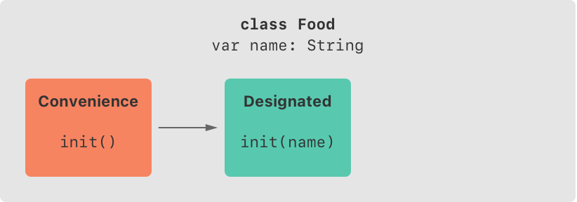

# Initialization - 2


# **Initializer Inheritance and Overriding**

## **Automatic Initializer Inheritance**

하위 클래스는 일반적으로 상위 클래스의 생성자를 상속하지 않는다.

그러나, 특정 조건에서는 자동으로 상속된다.

### Rule 1

하위 클래스에서 지정 생성자를 정의하지 않는 경우, 상위 클래스의 지정 생성자를 자동으로 상속한다.

### Rule 2

하위 클래스가 Rule 1에 따르거나 하위 클래스에서 상위 클래스의 모든 지정 생성자를 구현하면 상위 클래스의 간편 생성자를 자동으로 상속한다.

→ 이 규칙들은 하위 클래스에 간편 생성자를 추가해도 적용된다.

## **Designated and Convenience Initializers in Action**

위의 설명 예시

```swift
class Food {
    var name: String
    init(name: String) {
        self.name = name
    }
    convenience init() {
        self.init(name: "[Unnamed]")
    }
}

let namedMeat = Food(name: "Bacon")
// namedMeat's name is "Bacon"

let mysteryMeat = Food()
// mysteryMeat's name is "[Unnamed]"
```



- 간편 생성자가 지정 생정자를 delegate across

```swift
class RecipeIngredient: Food {
    var quantity: Int
    init(name: String, quantity: Int) {
        self.quantity = quantity
        super.init(name: name)
    }
    override convenience init(name: String) {
        self.init(name: name, quantity: 1)
    }
}

let oneMysteryItem = RecipeIngredient()
let oneBacon = RecipeIngredient(name: "Bacon")
let sixEggs = RecipeIngredient(name: "Eggs", quantity: 6)
```


- 지정 생성자가 Safety Check 1을 만족
    
    <aside>
    💡 Safety check 1:  상위 클래스의 생성자를 호출하기전에 해당 클래스의 모든 프로퍼티가 초기화되어야 함
    
    </aside>
    
- 간편 생성자의 매개변수가 상위 클래스의 지정 생성자와 똑같기 때문에 override로 작성
- 간편 생성자가 지정 생성자를 delegate across
- 상위 클래스의 지정 생성자를 모두 구현했기 때문에, 상위 클래스의 간편 생성자를 자동으로 상속
    - 이 간편 생성자는 Food 버전과 동일하게 기능하지만, 하위 클래스의 init(name)에 delegate across

```swift
class ShoppingListItem: RecipeIngredient {
    var purchased = false
    var description: String {
        var output = "\(quantity) x \(name)"
        output += purchased ? " ✔" : " ✘"
        return output
    }
}

var breakfastList = [
    ShoppingListItem(),
    ShoppingListItem(name: "Bacon"),
    ShoppingListItem(name: "Eggs", quantity: 6),
]
breakfastList[0].name = "Orange juice"
breakfastList[0].purchased = true
for item in breakfastList {
    print(item.description)
}
// 1 x Orange juice ✔
// 1 x Bacon ✘
// 6 x Eggs ✘
```


- 하위 클래스에서 지정 클래스를 지정하지 않기 때문에 상위 클래스의 지정 생성자와 간편 생성자를 모두 자동으로 상속

# **Failable Initializers**

- 초기화가 실패할 수 있을 때 사용하면 유용하다.
- init? 형식으로 사용
- failable 생성자와 non-failable 생성자의 패러미터와 이름이 같을 수 없다.
- failable 생성자는 초기화하는 타입에 optional value를 생성한다.
- 실패가 예상되는 지점에 `return nil` 를 사용한다.
    - 생성자는 값을 반환하지 않는다. 실패를 나타내기 위해 nil을 사용하지만, 초기화가 성공했을 때 return 키워드를 사용하지 않는다.

### numeric type conversions 예시

```swift
let wholeNumber: Double = 12345.0
let pi = 3.14159

if let valueMaintained = Int(exactly: wholeNumber) {
    print("\(wholeNumber) conversion to Int maintains value of \(valueMaintained)")
}
// Prints "12345.0 conversion to Int maintains value of 12345"

let valueChanged = Int(exactly: pi)
// valueChanged is of type Int?, not Int

if valueChanged == nil {
    print("\(pi) conversion to Int doesn't maintain value")
}
// Prints "3.14159 conversion to Int doesn't maintain value"
```

## **Failable Initializers for Enumerations**

- enum으로 사용할 때 활용 가능
- 열거 목록에 없을 경우 초기화 실패 (enum nil 반환)

## **Failable Initializers for Enumerations with Raw Values**

- raw value로 초기화하는 enum은 자동으로 failable 생성자를 수신한다.
- 일치 값이 없으면 초기화 실패를 트리거

## **Propagation of Initialization Failure**

- failable 생성자(클래스, 스트럭쳐, 이넘 포함)는 다른 failable 생성자에게 delegate across 가능
- 하위 클래스의 failable 생성자는 상위 클래스의 failable 생성자에게 delegate up 가능

→ 어떤 경우든 초기화가 실패하면 초기화 프로세스 전체가 즉시 실패하고 더 이상의 초기화 코드가 진행되지 않는다.

> failable 생성자는 non-failable 생성자에게 delegate 가능 
non-failable한 기존 초기화 프로세스에 잠재적인 실패 상태를 추가해야 하는 경우 사용
> 

```swift
class Product {
    let name: String
    init?(name: String) {
        if name.isEmpty { return nil }
        self.name = name
    }
}

class CartItem: Product {
    let quantity: Int
    init?(name: String, quantity: Int) {
        if quantity < 1 { return nil }
        self.quantity = quantity
        super.init(name: name)
    }
}
```

- CartItem의 초기화 실행 시 둘 중 하나라도 초기화를 실패하면 전체 초기화 프로세스 즉시 실패

## **Overriding a Failable Initializer**

- 상위 클래스의 failable 생성자를 하위 클래스가 override 가능
    - 상위 클래스의 failable 생성자를 하위 클래스가 non-failable 생성자로 override 가능
        
        → 이를 통해, 상위 클래스의 초기화가 실패해도 실패할 수 없는 하위 클래스 생성자를 정의할 수 있다.
        
        - 이 경우를 만족 시킬 유일한 방법은 상위 클래스 failable 생성자를 강제로 unwrap하는 것이다.
    - 위의 내용은 가능하지만 반대의 경우(non-failable 생성자를 failable 생성자로 override하는 것)은 불가능

```swift
class Document {
    var name: String?
    // this initializer creates a document with a nil name value
    init() {}
    // this initializer creates a document with a nonempty name value
    init?(name: String) {
        if name.isEmpty { return nil }
        self.name = name
    }
}

class AutomaticallyNamedDocument: Document {
    override init() {
        super.init()
        self.name = "[Untitled]"
    }
    override init(name: String) {
        super.init()
        if name.isEmpty {
            self.name = "[Untitled]"
        } else {
            self.name = name
        }
    }
}
```

- 상위 클래스의 지정 생성자를 모두 override
- 상위 클래스의 failable 생성자를 non-failable 생성자로 override

```swift
class UntitledDocument: Document {
    override init() {
        super.init(name: "[Untitled]")!
    }
}
```

- 강제 unwrapping으로 non-failable 생성자로 상속
- 상위 클래스의 init(name:) 생성자에 빈 문자열이 들어갈 경우, 런타임에러 발생
    
    → 항상 실패하지 않도록 매개변수를 사용해줘야 한다.
    

## **The init! Failable Initializer**

- Optional이 아닌 failable 생성자를 만들고 싶을 때 사용
- init! 형식
- init? → init!, init! → init? : delegate, override 가능
- init → init! : delegate할 수 있지만, init!이 실패한다면 assertion을 trigger 한다.

# **Required Initializers**

- 어떤 클래스의 모든 하위 클래스가 생성자를 필수적으로 구현하게 하고 싶을 때 사용
- `required` 키워드 사용
    - 연속적으로 발생한 하위 클래스에 이 생성자를 필수로 구현해야 함을 알리기 위해 required 키워드를 사용해야 한다.
- `override` 키워드는 사용 X
- 상속된 생성자를 사용하여 충족할 수 있으면, 필수 생성자를 명시적으로 구현할 필요 없다.
    
    → 충족: 모든 선언한 프로퍼티를 초기화하는 것 
    

```swift
protocol JSONInitializable { // Use Encoders, but just for example
    init(fromJSON: String)
}

class Foo: JSONInitializable  {
    let x: Int

    // "required" is necessary because this init is required for the 
    // conformance to JSONInitializable
    required init(fromJSON json: String) {
        //...
        x = 123 //some value from the JSON
    }
}

class Baz: Foo {
    // `init(fromJSON json: String)` can be inherited,
    // so it's implicitly defined for Baz, as well as Foo.
}

class Bar: Foo {
    // The presence of this uninitialized constant `y` requires an
    // a value in the declaration, or an initializer that sets it
    let y: Int

    // Since we didn't specify a value for `y` in its declaration,
    // this initializer must be explicitly specified so as to initialize `y`.
    // Doing so blocks the inheritance of `init(fromJSON json: String)` from
    // the super class, and requires us to define it ourselves,
    // in order to preserve conformance to `JSONInitializable`
    required init(fromJSON json: String) {
        //...
        y = 0
        super.init(fromJSON: json)
    }
}
```

# **Setting a Default Property Value with a Closure or Function**

- 저장 프로퍼티의 default 값에 설정이 필요한 경우, 클로저 또는 전역 함수를 사용할 수 있다.

```swift
class SomeClass {
    let someProperty: SomeType = {
        // create a default value for someProperty inside this closure
        // someValue must be of the same type as SomeType
        return someValue
    }()
}
```

- ()는 클로저를 즉시 실행하게 하며, 없을 경우 클로저 자체를 프로퍼티에 할당한다.
- 클로저가 실행되는 시점에 나머지 인스턴스는 아직 초기화가 되지 않았기 때문에 접근 할 수 없다.
    - self와 인스턴스 메서드 호출 불가능

### 출처

[https://docs.swift.org/swift-book/LanguageGuide/Initialization.html](https://docs.swift.org/swift-book/LanguageGuide/Initialization.html)

[https://stackoverflow.com/questions/44975479/what-does-this-mean-you-do-not-have-to-provide-an-explicit-implementation-of-a](https://stackoverflow.com/questions/44975479/what-does-this-mean-you-do-not-have-to-provide-an-explicit-implementation-of-a)
